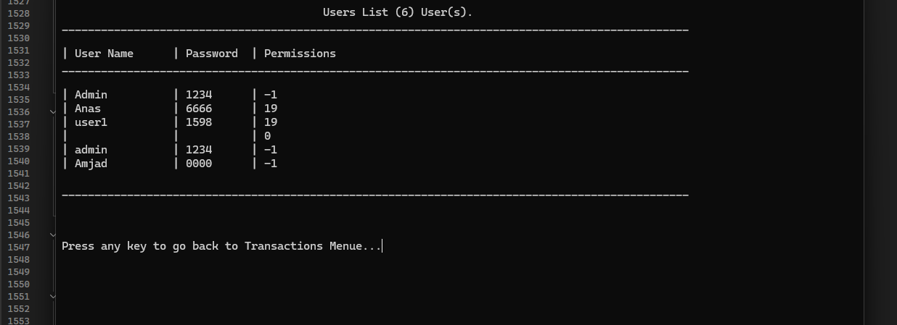

# 🏦 BankSystemManagement

**BankSystemManagement** is a console-based banking management application built with **C++**.  
It allows you to manage **clients** and **users** with a flexible permission system, as well as perform financial transactions like deposits, withdrawals, and viewing total balances.

---

## 📋 Features

- **Clients Management**:
  - Add a new client
  - Edit client details
  - Delete a client
  - Search for a client
  - Display a list of clients
  - Show total balances

- **Users Management**:
  - Add a new user with specific permissions
  - Edit user details
  - Delete a user
  - Search for a user
  - Display a list of users

- **Financial Transactions**:
  - Deposit money
  - Withdraw money
  - Show total bank balances

- **Permissions System**:
  - Granular permissions for each action
  - Option to grant **Full Access** or selected permissions
  - Permissions stored and validated using **Bitwise Operations**

---

## 🛠️ Technologies Used

- **Programming Language**: C++
- **Core Techniques**:
  - **Procedural Programming**
  - **Structs** for data structures
  - **Enums** for menus and permissions
  - **Vector STL** for in-memory storage
  - **File I/O** (`fstream`) for text-based storage
  - **String processing** (custom split functions)
  - **Bitwise operators** for storing and checking permissions

---

## 📂 Project Structure

BankSystemManager/
│
├── BankSystemManager.cpp # Main application code
├── Clients.txt # Clients data file
├── Users.txt # Users data file
├── BankSystemManager.vcxproj # Project configuration file
├── BankSystemManager.sln # Visual Studio solution file
└── README.md # This documentation file

markdown
Copier
Modifier

📌 **Clients.txt** and **Users.txt** use the same separator:  

- **Clients.txt**: `AccountNumber#//#PinCode#//#Name#//#Phone#//#Balance`
- **Users.txt**: `UserName#//#Password#//#Permissions`

---

## 🚀 How to Run

1. Open the project in **Visual Studio**:
   - Go to `File > Open > Project/Solution`
   - Select: `BankSystemManager.sln`

2. Ensure that the data files exist in the project directory:
   - `Clients.txt`
   - `Users.txt`

3. Run the project:
   - Press `Ctrl + F5` or click the run button in Visual Studio.

---

## 📸 Preview Screenshots

### 🔑 Login Screen

### 📜 Main Menu

### 👥 Clients List

### 👤 Users List

---

## 📌 Notes

- This project follows **Procedural Programming** with a clear separation of concerns.
- The `.txt` files act as the database for the application, so keep their structure intact.
- The project can be extended to use **SQL Server** or **SQLite** for better scalability.
- Great as a learning project for **OOP**, **File Handling**, and **Bitwise Permissions** in C++.

---

## ✨ Sample Data

📄 **Users.txt**:

admin#//#1234#//#-1

📄 **Clients.txt**:

C001#//#1111#//#John Doe#//#0612345678#//#1500.75

---

## 👨‍💻 Author

- **Name**: Yassine Amjad  
- **Tech Stack**: C++ → C# / .NET → SQL Server → ADO.NET → Entity Framework  
- **GitHub**: [amjadyassine](https://github.com/amjadyassine)
- **Linkedin**: [amjadyassine](https://www.linkedin.com/in/amjadyassine/).

